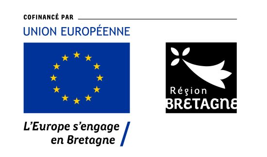

## Grants & Funding

  

    
Fellowship

    

      <h4>GROWD: Generative Modelling of Dense Crowds under Multiscale Observations, 2027 - 2028</h4>
      <figure class="fellowship-figure">
        
      </figure>
      
This Bienvenüe+ MSCA-COFUND Fellowship supports a 24-month independent research programme that I proposed and developed on generative modelling of dense crowds under multiscale observations.

      <ul>
        <li>Role: Project Lead / Research Fellow</li>
        <li>Host Institution: Inria Rennes</li>
        <li>Host Team: VirtUs</li>
        <li>Duration: 24 months</li>
        <li>Project Acronym: GROWD</li>
        <li>Research Direction: Dense crowd modelling, generative models, and crowd dynamics</li>
        <li>Core Aim: Integrating sparse, local, fine-grained agent-level observations with dense, global, coarse-grained video-derived measurements for uncertainty-aware crowd analysis.</li>
      </ul>
      
<a href="#project-growd">View the GROWD project overview</a>

    

  

  

    
Project

    

      <h4>Cross-Institutional Research Capacity Development in Human-Robot Interaction, 2025 - 2026</h4>
      <figure class="funding-figure">
        
      </figure>
      <ul>
        <li>Funding Source: Singapore Management University / Durham University, Singapore / UK</li>
        <li>Reference Number: 3787041; Value: £15,000</li>
        <li>Role: Research Assistant / Project Contributor</li>
        <li>Responsibilities included reviewing diffusion models in human-robot interaction, deploying trajectory planning experiments, managing the progress of another research assistant, and communicating with the SMU team on behalf of the Durham side.</li>
      </ul>
      
<a href="#project-smu-du">View the SMU-DU project overview</a>

    

  

