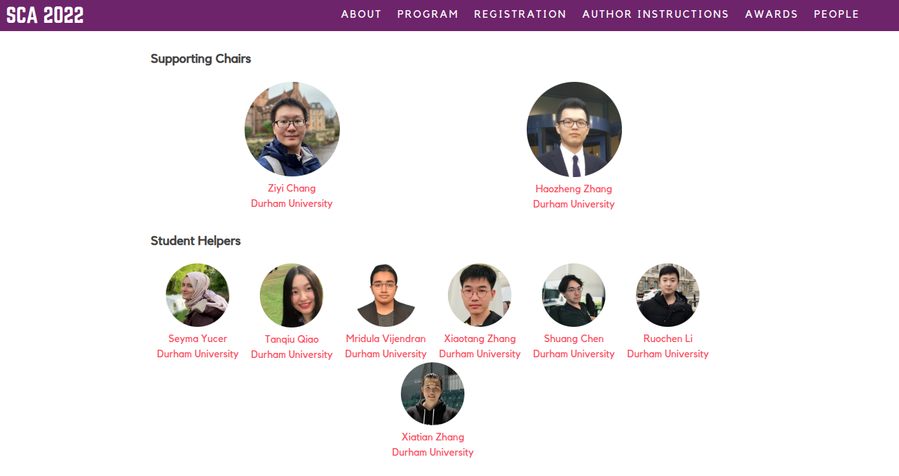

## Talks & Service

  

    
Service

    

      <h4>Conference Organisation</h4>
      
Supporting Chair of <a href="https://computeranimation.org/2022/people.html" target="_blank">the 21st ACM SIGGRAPH / Eurographics Symposium on Computer Animation</a> (SCA 2022).

      <figure class="funding-figure">
        
      </figure>
      <ul>
        <li>Led a 7-person support team.</li>
        <li>Coordinated with conference chairs, industrial partners, academic participants, business contacts, and service suppliers.</li>
      </ul>
    

  

  

    
Outreach

    

      <h4>Outreach and Public Engagement</h4>
      
Co-designed and delivered robotics and AI workshops for children at <a href="https://www.bullionhall.com/" target="_blank">Bullion Hall, UK</a>.

      <ul>
        <li>Promoted inclusive participation in STEM, with particular attention to encouraging girls to explore robotics and AI.</li>
        <li>Delivered accessible AI education sessions for older adults, focusing on practical understanding and trust in everyday AI technologies.</li>
      </ul>
    

  

  

    
Talks

    

      <h4>Invited Talks and Seminars</h4>
      
Coming soon.

    

  

